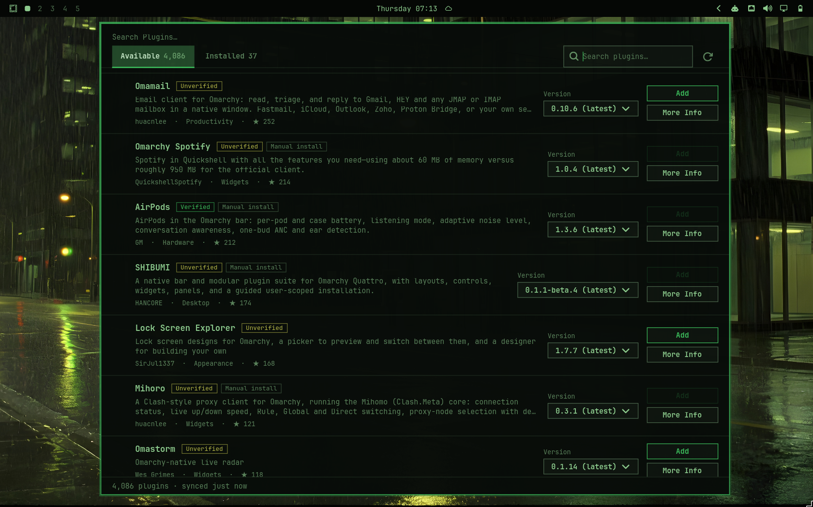

# OmaPlugs Browser

An Omarchy app to browse every available shell plugin and manage the ones on this machine.
Opens from **Setup › Plugins › Browse Plugins** (last row in that submenu, below Enable/Disable/Add/Clone/Remove).

**Requirements:** Python 3 with PyGObject, GTK4 and libadwaita — already present on any stock
Omarchy install (the same stack Omarchy's own shell tooling uses), so nothing extra to install.

- **Available** — everything: the built-in plugins plus the community marketplace
  (`plugins.omarchy.org`, ~3,700 listings). Installed ones carry an accent ✓ (a mark, not a checkbox).
- **Installed** — only what's on this machine.
- Each row: **Add / Remove**, **Enable / Disable**, **More Info**, and the version (a drop-down when
  older versions exist — git tags).
- **More Info** — description, developer + contact, licence, stars, marketplace verification, and links
  (repo, marketplace page, issues, releases, homepage). **Back** returns to the tab you came from.

- **Update** appears on a row only when the plugin has an update upstream (works even while it's disabled).
  Clicking it opens a bubble first: version and commit range, the commit messages, files changed, whether the
  plugin's code changes, and a link to the full diff — then **Update now** applies it.
- Bar widgets ask **where on the bar** (left / center / right / plugin default) when added or enabled.

Everything goes through Omarchy's own `omarchy-plugin-{add,remove,enable,disable,update,validate}`, so it
behaves exactly like Setup › Plugins. Add uses the same command the marketplace shows
(`omarchy plugin add <repo>.git --enable`), after showing Omarchy's own "unsandboxed code" warning.

Built-in plugins ship inside the omarchy package: they can be enabled/disabled but not removed.

### Doesn't compete with `omarchy plugin update`
Omarchy has no background updater; the CLI is the only other way plugins change. This app detects updates
read-only (`git ls-remote`), touches a plugin's folder only when you click, applies with Omarchy's own
`omarchy-plugin-update`, re-checks right before applying (skips if something else already updated it), refuses to
run while another add/update/remove or a git lock is active, and re-checks whenever the window regains focus.

### For scripts and AI agents
Every action is a plain Omarchy command, so agents don't need the GUI: `omarchy plugin add|remove|enable|disable|update`
and `omarchy plugin clone <builtin-id>` (copies a built-in to `~/.config/omarchy/plugins/<user>.<name>` and switches to it).
`omarchy_plugins.backend.clone_plugin()` wraps the clone the same way.

## Theme
Colours, borders and font size come from the current theme (`~/.local/state/omarchy/current/theme/{colors,shell}.toml`
— the same tokens the Omarchy menu uses). The app watches those files and repaints live when the theme changes.

## Try it safely (sandbox)
    ./omarchy-plugins --sandbox        # or: OMARCHY_PLUGINS_SANDBOX=1 ./omarchy-plugins

Needs no install. Shows the real catalog and your real installed plugins, but every action (add, remove, enable,
disable, update, version switch) is only simulated in memory, so the UI can be exercised without touching Omarchy.
Two layers: the actions are replaced by simulations, and any command that isn't on a read-only allow-list
(`omarchy-plugin-list/catalog`, `git ls-remote|rev-parse|describe|symbolic-ref|tag --list|remote get-url`, `pgrep`)
is refused outright. The cache lives in a temp folder that is deleted on exit. Plugins you "add" in the sandbox
come with a pretend update so you can try the Update bubble. Still real (read-only): the catalog download, GitHub
lookups on info pages, version lists via `git ls-remote`, and opening links in your browser.

## Install / uninstall (local menu row)
    ./install.sh
    ./install.sh --uninstall

Entirely per-user — no `sudo`, no system files touched. Links `~/.local/bin/omarchy-plugins`
and adds the menu row to your own `~/.config/omarchy/extensions/omarchy-menu.jsonc`. Because
Omarchy merges its own default menu first, a row added this way always lands *after* the
built-in rows in its submenu (below "Remove Plugin"), never above them. An earlier version
of this script edited Omarchy's root-owned default menu file instead; that needed sudo and
could be wiped by an Omarchy update, so it was abandoned in favor of this.

## Install from the marketplace (bar-widget)
    omarchy plugin add <this-repo-url>.git --enable

This repo is also a standalone Omarchy shell plugin: `manifest.json` + `BarWidget.qml` at the
repo root declare a `bar-widget` that adds a bar icon which opens this same app. This is the
form submitted to `plugins.omarchy.org` — see `SUBMISSION_GUIDE.md` for the full process. The
two install methods are independent and can coexist: the marketplace install adds a bar icon,
`./install.sh` adds a menu row: same app, two different launch points.

## Test
    python3 -m unittest discover -s tests -v

Cache: `~/.cache/omarchy-plugins/` (catalog with ETag, tag lists, GitHub developer lookups).
